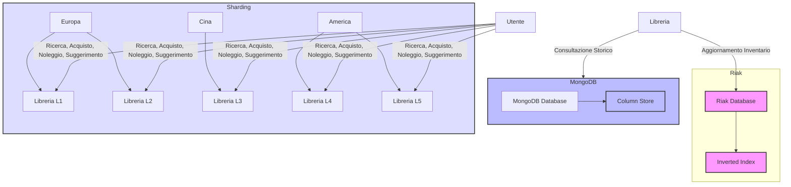

```mermaid
graph TD
    subgraph Riak
        RiakDB["Riak Database"]
        InvertedIndex["Inverted Index"]
        RiakDB --> InvertedIndex
    end

    subgraph MongoDB
        Mongo["MongoDB Database"]
        ColumnStore["Column Store"]
        Mongo --> ColumnStore
    end

    subgraph Sharding
        EU["Europa"]
        CN["Cina"]
        AM["America"]
        EU --> L1["Libreria L1"]
        EU --> L2["Libreria L2"]
        CN --> L3["Libreria L3"]
        AM --> L4["Libreria L4"]
        AM --> L5["Libreria L5"]
    end

    Utente -->|Ricerca, Acquisto, Noleggio, Suggerimento| L1
    Utente -->|Ricerca, Acquisto, Noleggio, Suggerimento| L2
    Utente -->|Ricerca, Acquisto, Noleggio, Suggerimento| L3
    Utente -->|Ricerca, Acquisto, Noleggio, Suggerimento| L4
    Utente -->|Ricerca, Acquisto, Noleggio, Suggerimento| L5
    
    Libreria -->|Aggiornamento Inventario| RiakDB
    Libreria -->|Consultazione Storico| MongoDB
    
    style RiakDB fill:#f9f,stroke:#333,stroke-width:2px;
    style InvertedIndex fill:#f9f,stroke:#333,stroke-width:2px;
    style MongoDB fill:#bbf,stroke:#333,stroke-width:2px;
    style ColumnStore fill:#bbf,stroke:#333,stroke-width:2px;
    style Sharding fill:#ddf,stroke:#333,stroke-width:2px;
```